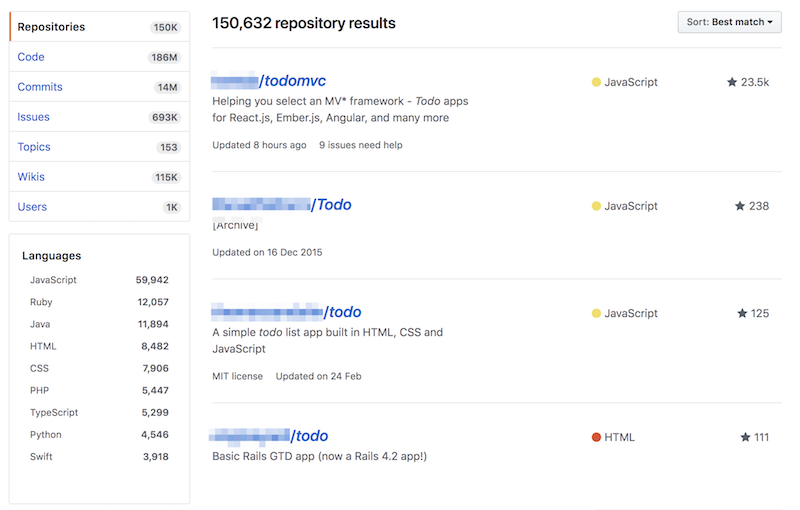

---

layout: ig

style: |

    #custom {
      background: black;
      padding-top: 0;
    }
    #custom h2 {
      color: yellow;
      margin-top: 70px;
    }

    .no-title h2 {
      display: none;
    }

    .code--size--m {
      font-size: 0.8em;
    }
    .slide .small {
      font-size: 50%;
    }
---

# How to use React, webpack and other buzzwords if there is no need  {#cover}

Varya Stepanova
{: .author }

<div class="title">
How to use

<span class="logos">
  ,
  
</span>
and other
<span class="buzz">buzzwords</span>
if there is no need
</div>

<!--
Cover image: http://www.adstasher.com/2013/06/k-y-jelly-love-machines-print-ads.html

-->

<style>

@import url('https://fonts.googleapis.com/css?family=Nunito');

#cover {
  text-align: left;
}

#cover:after {
  content: '';
  background-image:url('pictures/machine.jpg');
  background-size: cover;
  background-position: 0 0, center;
  opacity: 0.75;
  position: absolute;
  z-index: -1;
  top: 0;
  bottom: 0;
  right: 0;
  left: 0;
}

#cover:before {
  -webkit-filter: drop-shadow( -2px -2px 2px #000 );
  filter: drop-shadow( -2px -2px 2px #000 );
  text-align: left;
  width: 156px;
  height: 27px;
}

.author {
  font-size: 24px;
  margin-top: -5px;
  display: inline-block;
  position: absolute;
  right: 100px;
}

#cover h2 {
  display: none;
}

#cover .title {
  color: #FFF;
  font-size: 45px;
  font-family: 'Nunito', sans-serif;
  margin-top: 300px;
  line-height: 1.5em;
  text-align: center;
  -webkit-filter: drop-shadow( -2px -2px 2px #000 );
  filter: drop-shadow( -2px -2px 2px #000 );
}

#cover .title .logos {
  white-space: nowrap;
}

#cover .title .logo {
  height: 1.5em;
  margin-bottom: -20px;
}

#cover .title .buzz,
#cover .title .buzz * {
    -webkit-animation: cray 6s infinite steps(50);
          animation: cray 6s infinite steps(50);
  display: inline-block;
  font-size: 1.25em;
  color: pink;
}
@-webkit-keyframes cray {
  2% {
    font-weight: 400;
    font-style: normal;
    text-decoration: none;
  }
  4% {
    font-weight: 600;
    font-style: normal;
    text-decoration: none;
    text-transform: none;
  }
  6% {
    font-weight: 100;
    font-style: italic;
    text-decoration: none;
    text-transform: none;
  }
  8% {
    font-weight: 100;
    font-style: italic;
    text-decoration: line-through;
    text-transform: none;
  }
  10% {
    font-weight: 600;
    font-style: normal;
    text-decoration: none;
    text-transform: none;
  }
  12% {
    font-weight: 400;
    font-style: normal;
    text-decoration: none;
    text-transform: none;
  }
  14% {
    font-weight: 100;
    font-style: normal;
    text-decoration: none;
    text-transform: none;
  }
  16% {
    font-weight: 500;
    font-style: normal;
    text-decoration: none;
    text-transform: lowercase;
  }
  18% {
    font-weight: 700;
    font-style: italic;
    text-decoration: line-through;
    text-transform: none;
  }
  20% {
    font-weight: 600;
    font-style: normal;
    text-decoration: none;
    text-transform: none;
  }
  22% {
    font-weight: 200;
    font-style: normal;
    text-decoration: underline;
    text-transform: none;
  }
  24% {
    font-weight: 100;
    font-style: normal;
    text-decoration: none;
    text-transform: lowercase;
  }
  26% {
    font-weight: 400;
    font-style: normal;
    text-decoration: none;
    text-transform: none;
  }
  28% {
    font-weight: 100;
    font-style: normal;
    text-decoration: line-through;
    text-transform: none;
  }
  30% {
    font-weight: 200;
    font-style: normal;
    text-decoration: none;
    text-transform: none;
  }
  32% {
    font-weight: 400;
    font-style: italic;
    text-decoration: none;
    text-transform: none;
  }
  34% {
    font-weight: 200;
    font-style: normal;
    text-decoration: none;
    text-transform: none;
  }
  36% {
    font-weight: 500;
    font-style: italic;
    text-decoration: none;
  }
  38% {
    font-weight: 200;
    font-style: normal;
    text-decoration: none;
    text-transform: none;
  }
  40% {
    font-weight: 100;
    font-style: italic;
    text-decoration: none;
    text-transform: none;
  }
  42% {
    font-weight: 600;
    font-style: normal;
    text-decoration: none;
    text-transform: none;
  }
  44% {
    font-weight: 100;
    font-style: italic;
    text-decoration: none;
    text-transform: none;
  }
  46% {
    font-weight: 100;
    font-style: normal;
    text-decoration: none;
    text-transform: lowercase;
  }
  48% {
    font-weight: 700;
    font-style: normal;
    text-decoration: underline;
    text-transform: none;
  }
  50% {
    font-weight: 100;
    font-style: normal;
    text-decoration: none;
    text-transform: none;
  }
  52% {
    font-weight: 300;
    font-style: italic;
    text-decoration: none;
    text-transform: none;
  }
  54% {
    font-weight: 300;
    font-style: normal;
    text-decoration: none;
    text-transform: none;
  }
  56% {
    font-weight: 400;
    font-style: normal;
    text-decoration: underline;
    text-transform: none;
  }
  58% {
    font-weight: 100;
    font-style: normal;
    text-decoration: none;
  }
  60% {
    font-weight: 700;
    font-style: normal;
    text-decoration: none;
  }
  62% {
    font-weight: 200;
    font-style: normal;
    text-decoration: none;
    text-transform: none;
  }
  64% {
    font-weight: 600;
    font-style: normal;
    text-decoration: underline;
    text-transform: none;
  }
  66% {
    font-weight: 400;
    font-style: normal;
    text-decoration: line-through;
    text-transform: none;
  }
  68% {
    font-weight: 300;
    font-style: normal;
    text-decoration: underline;
    text-transform: none;
  }
  70% {
    font-weight: 100;
    font-style: normal;
    text-decoration: line-through;
  }
  72% {
    font-weight: 300;
    font-style: normal;
    text-decoration: none;
    text-transform: none;
  }
  74% {
    font-weight: 600;
    font-style: normal;
    text-decoration: none;
  }
  76% {
    font-weight: 600;
    font-style: normal;
    text-decoration: none;
    text-transform: none;
  }
  78% {
    font-weight: 300;
    font-style: normal;
    text-decoration: none;
    text-transform: none;
  }
  80% {
    font-weight: 400;
    font-style: normal;
    text-decoration: none;
    text-transform: none;
  }
  82% {
    font-weight: 100;
    font-style: normal;
    text-decoration: line-through;
    text-transform: none;
  }
  84% {
    font-weight: 200;
    font-style: normal;
    text-decoration: underline;
  }
  86% {
    font-weight: 600;
    font-style: normal;
    text-decoration: none;
  }
  88% {
    font-weight: 600;
    font-style: normal;
    text-decoration: underline;
    text-transform: none;
  }
  90% {
    font-weight: 300;
    font-style: normal;
    text-decoration: none;
    text-transform: none;
  }
  92% {
    font-weight: 400;
    font-style: normal;
    text-decoration: none;
    text-transform: none;
  }
  94% {
    font-weight: 500;
    font-style: normal;
    text-decoration: line-through;
  }
  96% {
    font-weight: 300;
    font-style: normal;
    text-decoration: none;
  }
  98% {
    font-weight: 100;
    font-style: italic;
    text-decoration: none;
    text-transform: none;
  }
}
@keyframes cray {
  2% {
    font-weight: 400;
    font-style: normal;
    text-decoration: none;
  }
  4% {
    font-weight: 600;
    font-style: normal;
    text-decoration: none;
    text-transform: none;
  }
  6% {
    font-weight: 100;
    font-style: italic;
    text-decoration: none;
    text-transform: none;
  }
  8% {
    font-weight: 100;
    font-style: italic;
    text-decoration: line-through;
    text-transform: none;
  }
  10% {
    font-weight: 600;
    font-style: normal;
    text-decoration: none;
    text-transform: none;
  }
  12% {
    font-weight: 400;
    font-style: normal;
    text-decoration: none;
    text-transform: none;
  }
  14% {
    font-weight: 100;
    font-style: normal;
    text-decoration: none;
    text-transform: none;
  }
  16% {
    font-weight: 500;
    font-style: normal;
    text-decoration: none;
    text-transform: lowercase;
  }
  18% {
    font-weight: 700;
    font-style: italic;
    text-decoration: line-through;
    text-transform: none;
  }
  20% {
    font-weight: 600;
    font-style: normal;
    text-decoration: none;
    text-transform: none;
  }
  22% {
    font-weight: 200;
    font-style: normal;
    text-decoration: underline;
    text-transform: none;
  }
  24% {
    font-weight: 100;
    font-style: normal;
    text-decoration: none;
    text-transform: lowercase;
  }
  26% {
    font-weight: 400;
    font-style: normal;
    text-decoration: none;
    text-transform: none;
  }
  28% {
    font-weight: 100;
    font-style: normal;
    text-decoration: line-through;
    text-transform: none;
  }
  30% {
    font-weight: 200;
    font-style: normal;
    text-decoration: none;
    text-transform: none;
  }
  32% {
    font-weight: 400;
    font-style: italic;
    text-decoration: none;
    text-transform: none;
  }
  34% {
    font-weight: 200;
    font-style: normal;
    text-decoration: none;
    text-transform: none;
  }
  36% {
    font-weight: 500;
    font-style: italic;
    text-decoration: none;
  }
  38% {
    font-weight: 200;
    font-style: normal;
    text-decoration: none;
    text-transform: none;
  }
  40% {
    font-weight: 100;
    font-style: italic;
    text-decoration: none;
    text-transform: none;
  }
  42% {
    font-weight: 600;
    font-style: normal;
    text-decoration: none;
    text-transform: none;
  }
  44% {
    font-weight: 100;
    font-style: italic;
    text-decoration: none;
    text-transform: none;
  }
  46% {
    font-weight: 100;
    font-style: normal;
    text-decoration: none;
    text-transform: lowercase;
  }
  48% {
    font-weight: 700;
    font-style: normal;
    text-decoration: underline;
    text-transform: none;
  }
  50% {
    font-weight: 100;
    font-style: normal;
    text-decoration: none;
    text-transform: none;
  }
  52% {
    font-weight: 300;
    font-style: italic;
    text-decoration: none;
    text-transform: none;
  }
  54% {
    font-weight: 300;
    font-style: normal;
    text-decoration: none;
    text-transform: none;
  }
  56% {
    font-weight: 400;
    font-style: normal;
    text-decoration: underline;
    text-transform: none;
  }
  58% {
    font-weight: 100;
    font-style: normal;
    text-decoration: none;
  }
  60% {
    font-weight: 700;
    font-style: normal;
    text-decoration: none;
  }
  62% {
    font-weight: 200;
    font-style: normal;
    text-decoration: none;
    text-transform: none;
  }
  64% {
    font-weight: 600;
    font-style: normal;
    text-decoration: underline;
    text-transform: none;
  }
  66% {
    font-weight: 400;
    font-style: normal;
    text-decoration: line-through;
    text-transform: none;
  }
  68% {
    font-weight: 300;
    font-style: normal;
    text-decoration: underline;
    text-transform: none;
  }
  70% {
    font-weight: 100;
    font-style: normal;
    text-decoration: line-through;
  }
  72% {
    font-weight: 300;
    font-style: normal;
    text-decoration: none;
    text-transform: none;
  }
  74% {
    font-weight: 600;
    font-style: normal;
    text-decoration: none;
  }
  76% {
    font-weight: 600;
    font-style: normal;
    text-decoration: none;
    text-transform: none;
  }
  78% {
    font-weight: 300;
    font-style: normal;
    text-decoration: none;
    text-transform: none;
  }
  80% {
    font-weight: 400;
    font-style: normal;
    text-decoration: none;
    text-transform: none;
  }
  82% {
    font-weight: 100;
    font-style: normal;
    text-decoration: line-through;
    text-transform: none;
  }
  84% {
    font-weight: 200;
    font-style: normal;
    text-decoration: underline;
  }
  86% {
    font-weight: 600;
    font-style: normal;
    text-decoration: none;
  }
  88% {
    font-weight: 600;
    font-style: normal;
    text-decoration: underline;
    text-transform: none;
  }
  90% {
    font-weight: 300;
    font-style: normal;
    text-decoration: none;
    text-transform: none;
  }
  92% {
    font-weight: 400;
    font-style: normal;
    text-decoration: none;
    text-transform: none;
  }
  94% {
    font-weight: 500;
    font-style: normal;
    text-decoration: line-through;
  }
  96% {
    font-weight: 300;
    font-style: normal;
    text-decoration: none;
  }
  98% {
    font-weight: 100;
    font-style: italic;
    text-decoration: none;
    text-transform: none;
  }
}


</style>

<!-- Picture credits: http://www.createmydreamlifestyle.com/index.php/2016/07/30/advantages-of-the-laptop-lifestyle/ -->


## Me
{: .no-title .about-me }

{: .photo }

### Now
Design Systems Specialist<br/> at Intergalactico <sub class="small">Nordcloud Design Studio</sub>

### Before
TMG (Amsterdam, the Netherlands); Yandex&nbsp;(Moscow,&nbsp;Russia)

### Area of expertise
Components on the web: design systems, pattern libraries, SGDD, BEM. Techs: CSS, JavaScript, etc.

<!--
Before we start, I would like to introduce myself and explain why
this topic has been chosen.
-->

<style>
.about-me p {
  font-size: 80%;
}
.about-me .photo {
  float: left;
  width: 300px;
  margin-top: 1em;
  margin-bottom: 6em;
  margin-right: 1em;
  border-radius: 50%;
}
</style>


## How to study new?
{: .how .cover }

<style>
.how {
  background-image:url('pictures/chicken-egg.jpg');
  background-size: cover;
  background-position: 0 0, center;
  background-color: #FDED5B;
}
</style>


## How to study new?




## Blog

* Open source
* Hosted on GitHub
* Source in Markdown
* Technologies I use or want to use at work


## March 2013: {: .jekyll }
{: .tech-stack--jekyll }
{: .bem }
{: .gnu }
<span class="borschik">borschik</span>
<span class="csso">CSSO</span>
<span class="bem-core">bem-core</span>
<span class="bem-tools">bem-tools</span>

<style>

.tech-stack--jekyll .jekyll {
  height: 125px;
  margin-bottom: -30px;
}

.tech-stack--jekyll .bem {
  height: 100px;

  /* animation: rot 4.5s infinite linear;*/
}
.tech-stack--jekyll .gnu {
  height: 100px;

  /* animation: rot 4.5s infinite linear;
  animation-delay: 0.75s; */
}

@import url('https://fonts.googleapis.com/css?family=Anton');

.tech-stack--jekyll .borschik {
  -webkit-box-sizing: content-box;
  -moz-box-sizing: content-box;
  box-sizing: content-box;
  border: none;
  font: normal 40px/normal "Anton", Helvetica, sans-serif;
  color: rgb(112, 112, 112);
  text-transform: uppercase;
  -o-text-overflow: clip;
  text-overflow: clip;
  letter-spacing: 5px;
  text-shadow: 3px 3px 0 rgb(238,238,238) , 5px 5px 0 rgb(112,112,112) ;

  /*animation: rot 4.5s infinite linear;
  animation-delay: 1.5s;*/
}

.tech-stack--jekyll .csso {
  font-family: Verdana;
  font-size: 50px;

  /*animation: rot 4.5s infinite linear;
  animation-delay: 2.25s; */
}
.tech-stack--jekyll .csso::first-letter {
  color: red;
}

.tech-stack--jekyll .bem-core {
  font-family: 'CoreCircus', sans-serif;
  text-transform: uppercase;
  font-size: 40px;
  line-height: 1;
  color: #f98ca4;
  text-shadow: -1px -1px 0 #6e1f58, 1px -1px 0 #6e1f58, -1px 1px 0 #6e1f58, 1px 1px 0 #6e1f58, 1px 0px 0px #65f283, 0px 1px 0px #65f283, 2px 1px 0px #65f283, 1px 2px 0px #65f283, 3px 2px 0px #65f283, 2px 3px 0px #65f283, 4px 3px 0px #65f283, 3px 4px 0px #65f283, 5px 4px 0px #65f283, 3px 5px 0px #6e1f58, 6px 5px 0px #6e1f58, -1px 2px 0 black, 0 3px 0 #6e1f58, 1px 4px 0 #6e1f58, 2px 5px 0px #6e1f58, 2px -1px 0 #6e1f58, 3px 0 0 #6e1f58, 4px 1px 0 #6e1f58, 5px 2px 0px #6e1f58, 6px 3px 0 #6e1f58, 7px 4px 0 #6e1f58, 10px 10px 4px #dac249;

  /*animation: rot 4.5s infinite linear;
  animation-delay: 3s;*/
}

.tech-stack--jekyll .bem-tools {

  font-family: Menlo;
  font-size: 40px;

  /*animation: rot 4.5s infinite linear;
  animation-delay: 3.75s;*/
}


/*
 * Webfont: CoreCircus by S-Core
 * URL: http://www.myfonts.com/fonts/s-core/core-circus/regular/
 * Copyright: Copyright (c) 2013 by S-Core Co., Ltd.. All rights reserved.
 * Licensed pageviews: 10,000
*
 * Webfont: CoreCircus2DDot1 by S-Core
 * URL: http://www.myfonts.com/fonts/s-core/core-circus/dot1/
 * Copyright: Copyright (c) 2013 by S-Core Co., Ltd.. All rights reserved.
 * Licensed pageviews: 10,000
*/
@font-face {
  font-family: 'CoreCircus2DDot1';
  src: url("https://s3-us-west-2.amazonaws.com/s.cdpn.io/209981/333BF4_1_0.eot");
  src: url("https://s3-us-west-2.amazonaws.com/s.cdpn.io/209981/333BF4_1_0.eot?#iefix") format("embedded-opentype"), url("https://s3-us-west-2.amazonaws.com/s.cdpn.io/209981/333BF4_1_0.woff2") format("woff2"), url("https://s3-us-west-2.amazonaws.com/s.cdpn.io/209981/333BF4_1_0.woff") format("woff"), url("https://s3-us-west-2.amazonaws.com/s.cdpn.io/209981/333BF4_1_0.ttf") format("truetype");
}
@font-face {
  font-family: 'CoreCircus';
  src: url("https://s3-us-west-2.amazonaws.com/s.cdpn.io/209981/333BF4_8_0.eot");
  src: url("https://s3-us-west-2.amazonaws.com/s.cdpn.io/209981/333BF4_8_0.eot?#iefix") format("embedded-opentype"), url("https://s3-us-west-2.amazonaws.com/s.cdpn.io/209981/333BF4_8_0.woff2") format("woff2"), url("https://s3-us-west-2.amazonaws.com/s.cdpn.io/209981/333BF4_8_0.woff") format("woff"), url("https://s3-us-west-2.amazonaws.com/s.cdpn.io/209981/333BF4_8_0.ttf") format("truetype");
}
@font-face {
  font-family: 'CoreCircusPierrot4';
  src: url("https://s3-us-west-2.amazonaws.com/s.cdpn.io/209981/333BF4_13_0.eot");
  src: url("https://s3-us-west-2.amazonaws.com/s.cdpn.io/209981/333BF4_13_0.eot?#iefix") format("embedded-opentype"), url("https://s3-us-west-2.amazonaws.com/s.cdpn.io/209981/333BF4_13_0.woff2") format("woff2"), url("https://s3-us-west-2.amazonaws.com/s.cdpn.io/209981/333BF4_13_0.woff") format("woff"), url("https://s3-us-west-2.amazonaws.com/s.cdpn.io/209981/333BF4_13_0.ttf") format("truetype");
}

</style>


## May 2014: DOCPAD
{: .tech-stack--dockpad }

{: .grunt }
{: .gulp }
<span class="styleguide">styleguide</span>
<span class="visual-tests">visual regression tests</span>

<style>
.tech-stack--dockpad .grunt {
  height: 125px;
}
.tech-stack--dockpad .gulp {
  height: 125px;
}
</style>

## January 2017: Metalsmith

* React.js for HTML generation and client interactions
* css modules for styling
* Webpack build

<!--
[Jekyll](https://jekyllrb.com/)<br/>
   March 2013. Plain CSS, month later - BEM, GNUmake building, Borschik + CSSO
   July 2013: using bem-core library, BH template engine
   Oct 2013: bem-tools@1.0.0
   April 2014: bem-core@2
1. Docpad
   May 2014. Grunt
   Jul 2015: Automatic generated styleguide, Gulp for building
   Oct 2015: visual regression tests
1. Metalsmith
   Jan 2017. React as templating solution + react on client + css-modules
-->


## File structure

```bash
content/
  posts/
    my-awesome-post/
      index_<mark class="important">en</mark>.md
      index_<mark class="important">ru</mark>.md
```

[http://varya.me/<mark class="important">en</mark>/posts/my-awesome-post/](http://varya.me)<br/>
[http://varya.me/<mark class="important">ru</mark>/posts/my-awesome-post/](http://varya.me)


## Metalsmith blog

1. Manipulates `*.md` files according to config and processes them using different <mark class="important">plugins</mark>.
1. Generates static HTML by <mark class="important">React templates</mark>.

   CSS modules give unique classes.
   {: .note }
1. Builds CSS and JS with <mark class="important">Webpack</mark>.

   CSS classes match!
   {: .note }
1. Client React works in browser.


## Pros & cons
{: .pros-cons }

### Happy

* Fancy new technologies
* Fast building process
* Not large codebase, open for experiments
* Getting used to new technologies


### Sad

* Writing a blog and not wiring for the blog :-)
* Solution specific limits

<style>
.pros-cons h2 {
  display: none;
}
</style>


## Thank you
{: .thanks }

Varya Stepanova, Intergalactico - Nordcloud Design Studio<br/>
[@varya_en](https://twitter.com/varya_en){: .twitter }; on the web: [varya.me](http://varya.me){: .web }

### Slides

### [varya.me/react-finland-2018](http://varya.me/react-finland-2018/)

<style>
.thanks h3 {
  font-size: 28px;
  margin-bottom: 0.5em;
  margin-top: 1em;
  line-height: 1.25em;
}
.thanks .twitter
{
  text-decoration: none;
  color: currentColor;
  background: none;
  border-bottom: 0;
}
.thanks .twitter::before
{
  content: "";
  display: inline-block;
  width: 1.5em;
  height: 1.5em;
  background-image:url('pictures/twitter-logo.png');
  background-size: cover;
  margin-right: 0.5em;
  margin-bottom: -0.5em;
}
</style>
